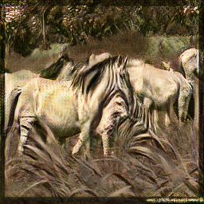
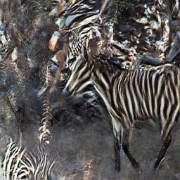
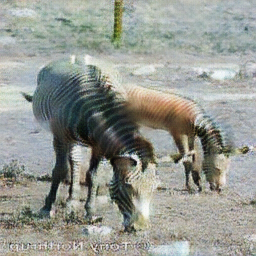
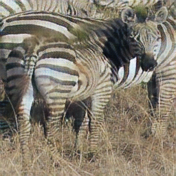

# Implementation of the paper Unpaired Image-to-Image Translation using Cycle-Consistent Adversarial Networks

### Images generated from the CycleGAN model.

* Horse to Zebra

* Zebra to Horse

The shape is of the horse, but strips are still visible. Have to improve this!

* Trained for 150 epochs, with a learning rate of 1e-5 (eventhough the paper mentioned 2e-4). Should experiment with this. 
* Didn't use Identity loss.